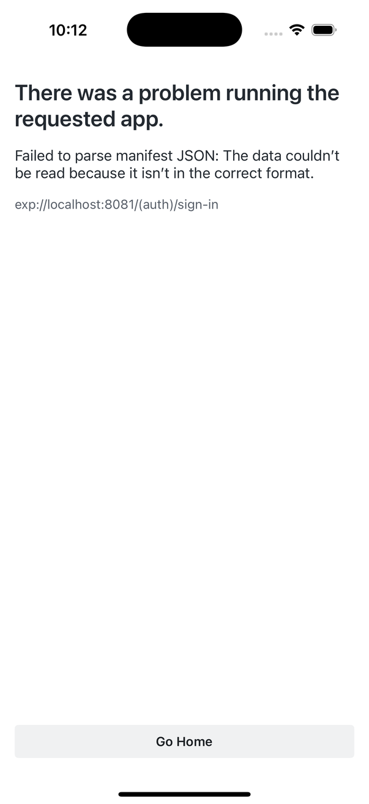

# App State Capture

**Timestamp:** 2026-04-02T22:12:43.071948

## Device
- Name: iPhone 16 Pro Clean
- UDID: D215C773-3DF4-4577-B041-6C0C5B0113DE
- State: Booted

## Screenshot

## Accessibility
- Elements: 9

## Logs
- Lines: 2
- Warnings: 0
- Errors: 0

## Files
- `screenshot.png` - Current screen
- `accessibility-tree.json` - Full UI hierarchy
- `app-logs.txt` - Recent app logs
- `device-info.json` - Device details
- `summary.json` - Complete capture metadata
